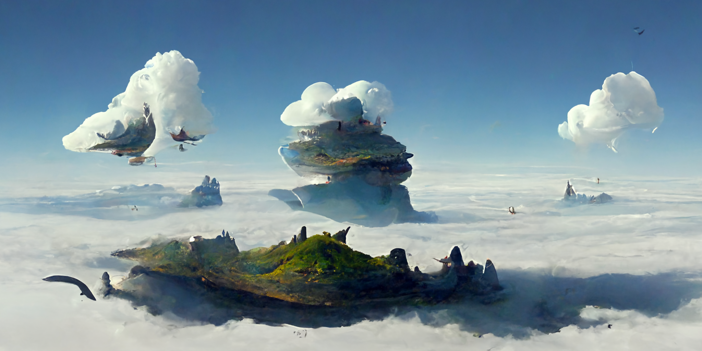
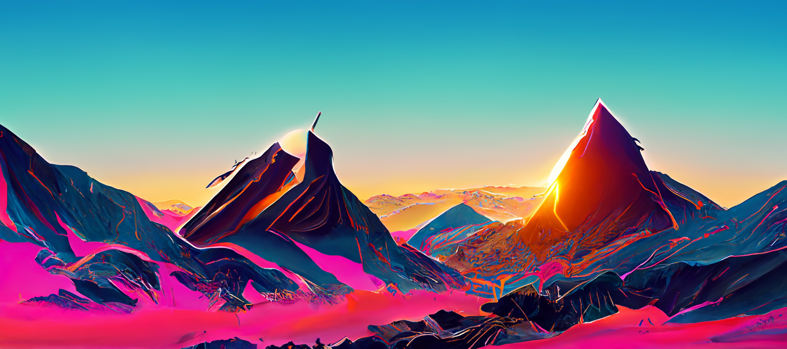
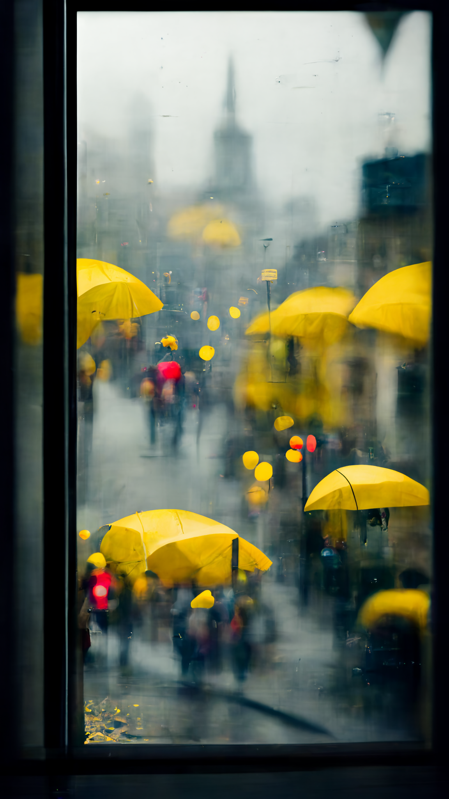
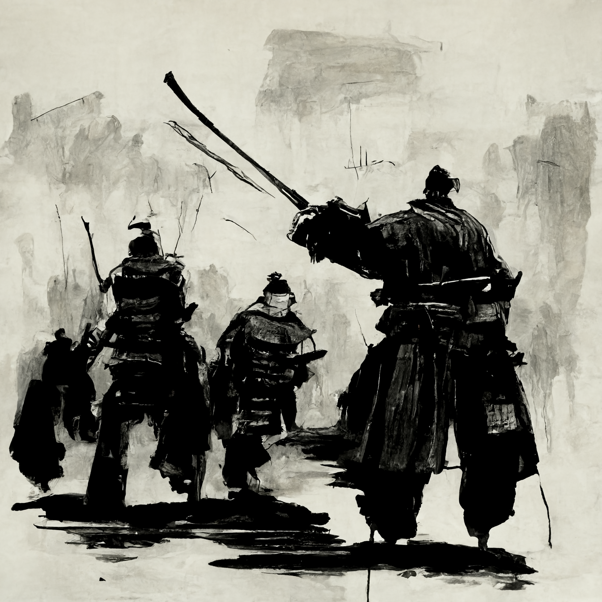
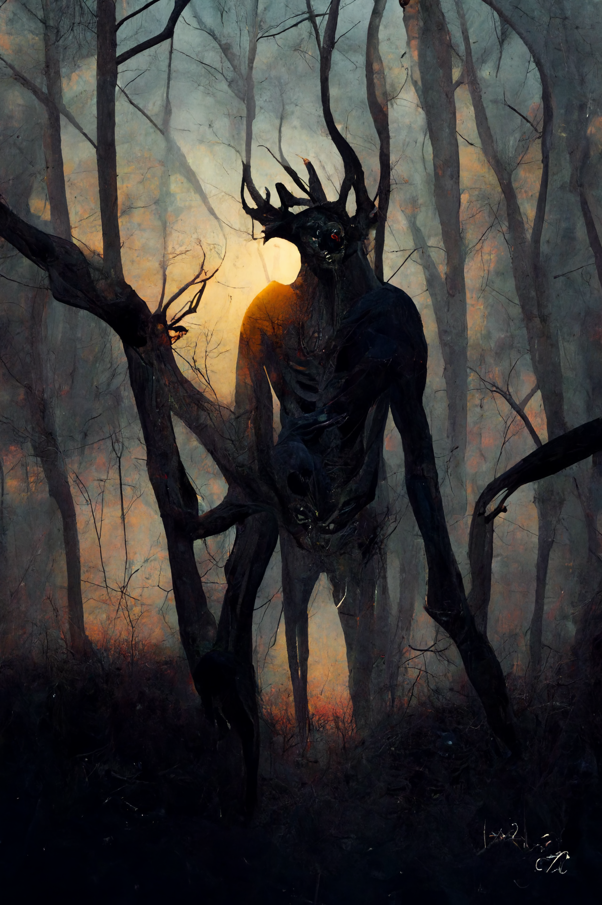
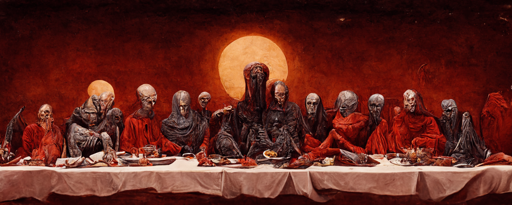
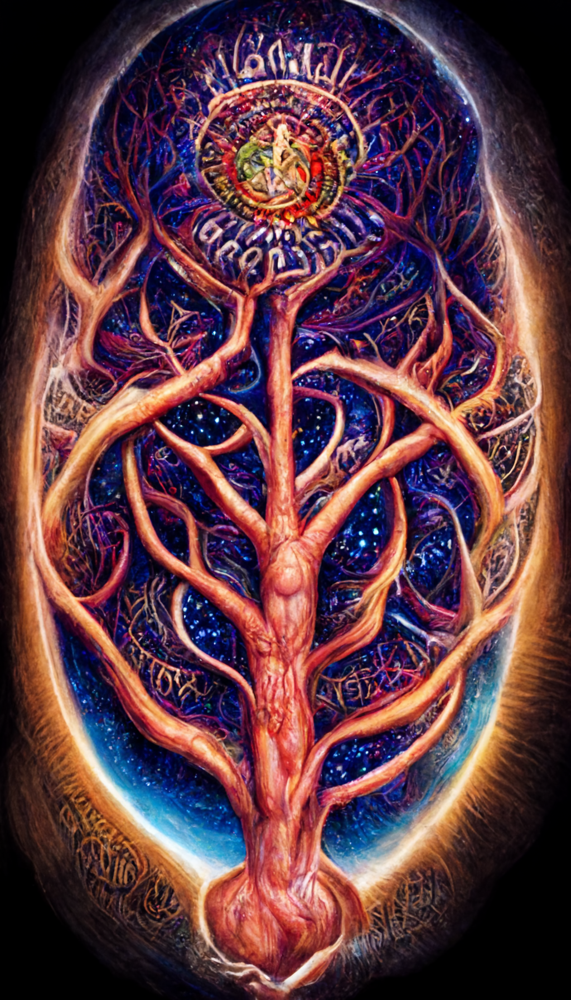

# Creativity and AI

07/17/2022

<figure>
    
    <figcaption>Image generated by Midjourney with the prompt: a yellow and orange robot in a forest during rain</figcaption>
</figure>

It has long been thought artificial intelligence and robots would free us of physical and mental labor and leave creative work, such as visual art, as a domain of people. However, recent developments have brought this assumption into question.

In the last year there has been a lot of progress made in AI that can generate images from text prompts. The most popular being Midjourney and OpenAI's DALLE-2. All you need to do is provide a prompt describing what you want it to generate and seconds later you get a set of variations of the prompt.

The results have been so impressive people are wondering how this will affect the commercial art world. It's still not exactly perfect but it's more than good enough for tasks like finding inspiration and creating textures. Another tool in the toolbox for digital artists both 2D and 3D. Although the long term effects of the technology are difficult to predict at this time.

It also raises questions on the nature of creativity. I don't think you can say that these AI are conscious, yet despite this they can generate wholly novel and creative images. So if consciousness is not required for creativity then what exactly is it?

I believe that what we typically call a creative process is simply a problem solving process. An artist and an engineer are performing the same process in different domains. Consciousness is merely the driver pulling the levers and turning knobs of different parts of the brain to achieve some desired result. So it was inevitable that these digital neural networks which are very good at problem solving to get very good at doing visual art. Further, given the nature of art being more forgiving when it comes to "solutions" to a "problem" it's not surprising that they are getting very good at this task very quickly. They don't need to contend with the precise nature of physics or limitations in manufacturing techniques in engineering for example. They only need to create something that looks good to human eyes.

We have a ways to go with the technology but I believe it will have a huge impact far before it's perfect. It seems likely that certain fields such as concept art will be dominated by tools like this.

All that aside, so far there are no FOSS alternatives and I'm not sure how feasable it is for one to be made anytime soon. Hopefully I'm wrong and large companies don't come to hold a monopoly in this space.

## Midjourney Art

Here are some images I generated using Midjourney

